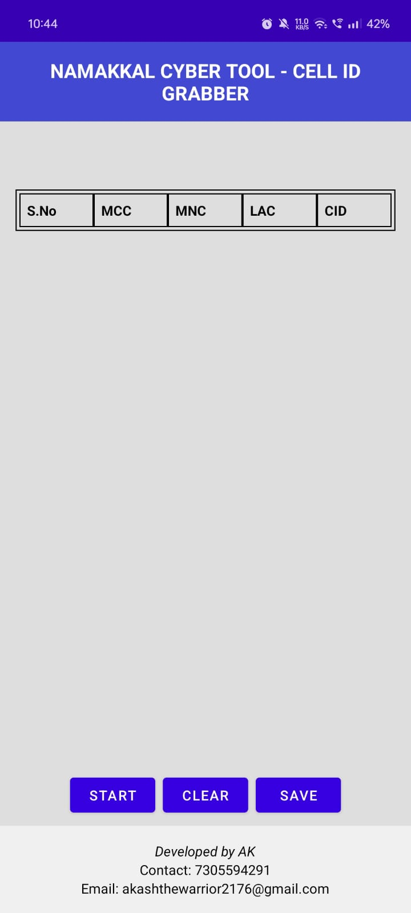
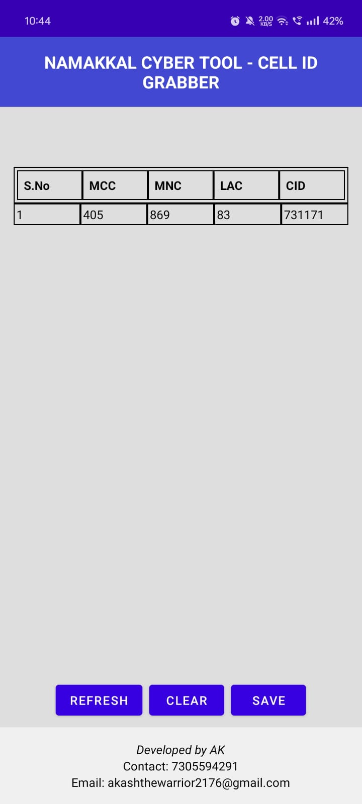
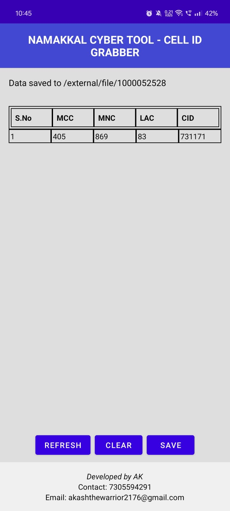

# Cell-ID Grabber

**Cell-ID Grabber** is an Android application that collects and displays cell tower information, including Mobile Country Code (MCC), Mobile Network Code (MNC), Location Area Code (LAC), and Cell ID (CID). The app provides an easy-to-use interface for viewing, refreshing, clearing, and saving cell tower data.

---

## Features

- **Retrieve Cell Tower Information:**
  - Collect data such as MCC, MNC, LAC, and CID from nearby cell towers.
- **Real-Time Refresh:**
  - Update cell tower data dynamically with a single tap.
- **Save Data:**
  - Save collected data to a `.txt` file in the device's documents folder.
- **Clear Data:**
  - Easily reset the displayed information to start fresh.
- **Permissions Handling:**
  - Automatically checks and requests necessary permissions for location and telephony services.

---

## Screenshots

| Feature                  | Screenshot |
|--------------------------|------------|
| **Main Screen**          ||
| **Table of Cell Towers** ||
| **Save Confirmation**    ||

---

## Installation

1. Clone the repository:
   ```bash
   git clone https://github.com/yourusername/cell-id-grabber.git
   ```

2. Open the project in **Android Studio**:
   - File > Open > Select the project folder.

3. Sync Gradle:
   Android Studio will automatically sync Gradle dependencies.

4. Build the project:
   - Use the "Build" option in the top menu or the green hammer icon.

5. Run the app:
   - Connect an Android device or use an emulator, then click the "Run" button.

---

## Usage

1. **Grant Permissions:**
   When you launch the app for the first time, it will request the following permissions:
   - `READ_PHONE_STATE`
   - `ACCESS_FINE_LOCATION`
   - `ACCESS_COARSE_LOCATION`

2. **Collect Data:**
   - Tap the **"Start/Stop"** button to begin collecting cell tower data.
   - Data will be displayed in a tabular format.

3. **Refresh Data:**
   - Tap **"Refresh"** (when data collection is active) to update the displayed information.

4. **Clear Data:**
   - Tap the **"Clear"** button to reset the table.

5. **Save Data:**
   - Tap **"Save"** to export the data as a `.txt` file in your device’s Documents folder.

---

## Requirements

- **Minimum Android Version:** Android 8.0 (API 26)
- **Permissions Required:**
  - Phone State
  - Fine Location
  - Coarse Location

---

## Permissions

The app requires the following permissions to function:

1. **Phone State:**
   - To retrieve cell tower information from the device's telephony services.

2. **Fine and Coarse Location:**
   - To access cell tower location data.

The app will prompt the user to grant these permissions during runtime. If permissions are denied, the app will display an error message.

---

## Technologies Used

- **Kotlin**
- **Android SDK**
- **TelephonyManager API**
- **MediaStore API**
- **TableLayout and UI Components**

---

## Contributing

We welcome contributions to improve the app!

1. Fork the repository.
2. Create a new branch:
   ```bash
   git checkout -b feature/your-feature-name
   ```
3. Make your changes and commit them:
   ```bash
   git commit -m "Add your message here"
   ```
4. Push your branch:
   ```bash
   git push origin feature/your-feature-name
   ```
5. Open a pull request.

---

## License

This project is licensed under the MIT License. See the [LICENSE](LICENSE.txt) file for details.

---

## Contact

For any inquiries or issues, feel free to reach out:
- **Author:** Akash 😉
- **Email:** akashthewarrior2176@gmail.com
- **GitHub:** [Akash-2176](https://github.com/Akash-2176)

---
